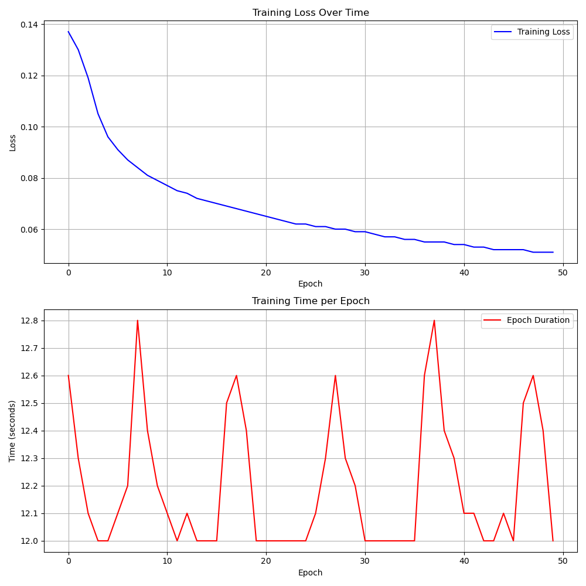

# SuperTuxKart Trail 4

## Planner Settings
- **Model**: 
    - `CNN with 3 layers`
    - `Utilizes MaxPool and AvgPool`
- **Learning Rate**: `1e-4`  
- **Epochs**: `500`  
- **Dataset**: `30,000 images`  

## Results
- **Loss**: `0.011`  

## Course times (Averages)
- **Zengarden**: `t = 410`  
- **Lighthouse**: `t = 437`  
- **Hacienda**: `t = 529`  
- **Snowtuxpeak**: `t = 731`  
- **Cornfield Crossing**: `t = 679`  
- **Scotland**: `t = 643`  

---

## Summary
- Used trial 1 Planner
- All the courses were completed in their allocated time
- Still struggled with pits and cliffs show on Snowtuxpeak
- Struggled with barrels and bananas on Cornfield Crossing
- Made key changes to controller
    - Adaptive drift and velocity, protections versus nitro steering cart off course
    - Seemed to work better for most maps 
- Look into reworking CNN

