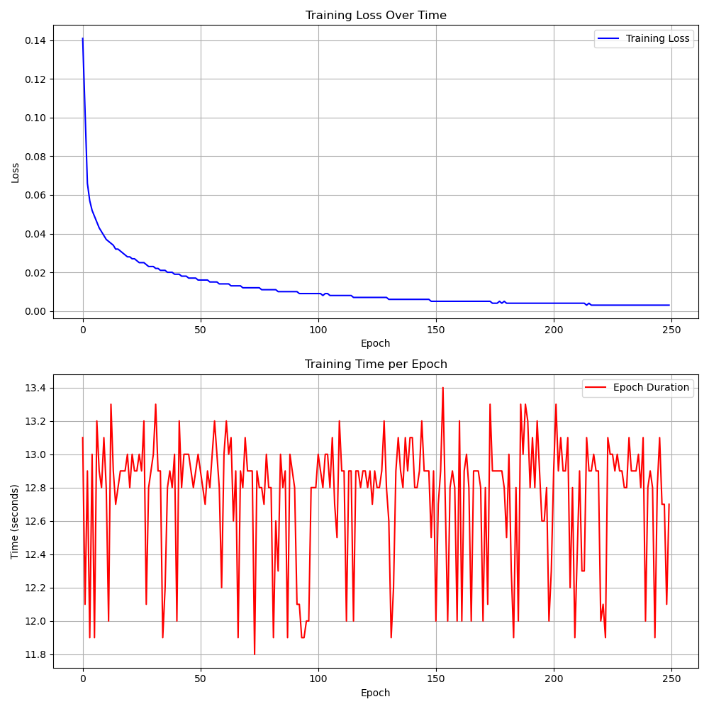

# SuperTuxKart Trial 5

## Planner Settings
- **Model**: 
    - `CNN with 5 layers`
    - `Utilizes MaxPool and AvgPool`
- **Learning Rate**: `1e-4`  
- **Epochs**: `250`  
- **Dataset**: `30,000 images`  

## Results
- **Loss**: `0.003`  

## Course times (Averages)
- **Zengarden**: `t = 404`  
- **Lighthouse**: `t = 435`  
- **Hacienda**: `t = 549`  
- **Snowtuxpeak**: `t = 731`  
- **Cornfield Crossing**: `t = 689`  
- **Scotland**: `t = 568`  

---

## Summary
- Expanded Trial 4 CNN and only added more CNN layers with pooling methods
- Utilized the new controller used in Trial 4
- All the courses were completed in their allocated time
- Still struggled with pits and cliffs show on Snowtuxpeak
- Struggled with barrels and bananas on Cornfield Crossing
- Achieved our best loss and consistent results so far
